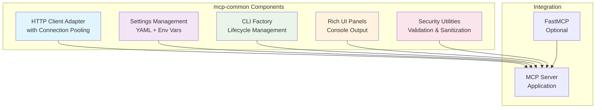
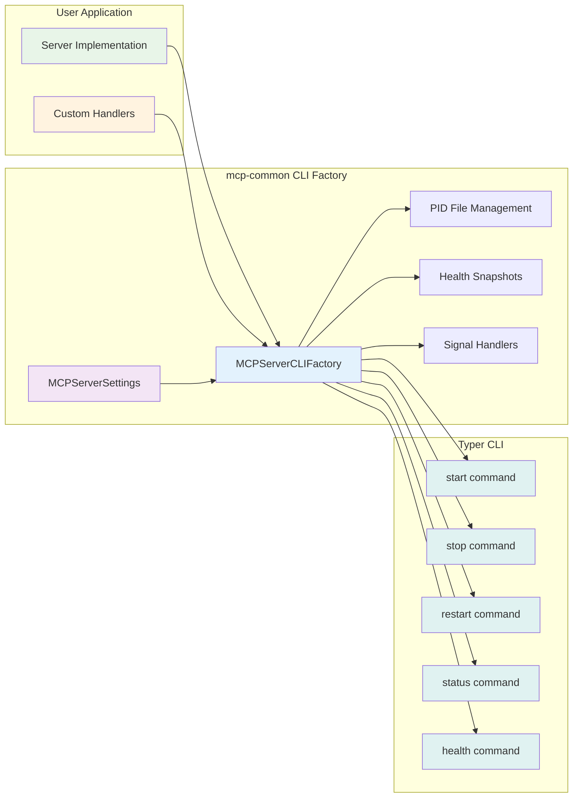

# mcp-common

[](https://github.com/lesleslie/crackerjack)
[](https://github.com/lesleslie/oneiric)
[](https://github.com/astral-sh/uv)
[](https://www.python.org/downloads/)

**Version:** 0.6.0 (Oneiric-Native)
**Status:** Production Ready

---

## Quick Links

- [Overview](#overview)
- [Examples](#-examples)
- [Quick Start](#quick-start)
- [Configuration](#configuration)
- [Testing](#testing)

## Overview

mcp-common is a **Oneiric-native foundation library** for building production-grade MCP (Model Context Protocol) servers. It provides battle-tested patterns extracted from production servers including Crackerjack, Session Buddy, and FastBlocks.

## Quality & CI

Crackerjack is the standard quality-control and CI/CD gate for changes to this library and the downstream MCP servers that build on it.

**🎯 What This Library Provides:**

- **Tool Profile System** (v0.6.0+) - Gated tool registration to reduce MCP context overhead (391 tools across 5 servers)
- **Description Trimming** (v0.6.0+) - Utility to trim tool docstrings to 200 chars for token efficiency
- **Oneiric CLI Factory** (v0.3.3+) - Standardized server lifecycle with start/stop/restart/status/health commands
- **HTTP Client Adapter** - Connection pooling with httpx for 11x performance
- **Prompting/Notification Adapter** 🆕 - Unified cross-platform user interaction with automatic backend detection
- **Security Utilities** - API key validation (with 90% faster caching) and input sanitization (2x faster)
- **Rich Console UI** - Beautiful panels and notifications for server operations
- **Settings Management** - YAML + environment variable configuration (Pydantic-based)
- **Health Check System** - Production-ready health monitoring
- **Type-Safe** - Full Pydantic validation and type hints
- **Comprehensive Testing** - 615 tests with property-based and concurrency testing

**Design Principles:**

1. **Oneiric-Native** - Direct Pydantic, Rich library, and standard patterns
1. **Production-Ready** - Extracted from real production systems
1. **Layered Configuration** - YAML files + environment variables with clear priority
1. **Rich UI** - Professional console output with Rich panels
1. **Type-safe** - Full type hints with strict MyPy checking
1. **Well-Tested** - 90% coverage minimum

---

## 📚 Examples

See [`examples/`](./examples/) for complete production-ready examples:

### 1. CLI Server (Oneiric-Native) - NEW in v0.3.3

Demonstrates the **CLI factory** for standardized server lifecycle management:

- 5 lifecycle commands (start, stop, restart, status, health)
- PID file management with security validation
- Runtime health snapshots
- Graceful shutdown with signal handling
- Custom lifecycle handlers

```bash
cd examples
python cli_server.py start
python cli_server.py status
python cli_server.py health
python cli_server.py stop
```

### 2. Weather MCP Server (Oneiric-Native)

Demonstrates **HTTP adapters** and **FastMCP integration**:

- HTTPClientAdapter with connection pooling (11x performance)
- MCPBaseSettings with YAML + environment configuration
- ServerPanels for beautiful terminal UI
- Oneiric configuration patterns (direct instantiation)
- FastMCP tool integration (optional; install separately)

```bash
cd examples
python weather_server.py
```

**Full documentation:** [`examples/README.md`](./examples/README.md)

---

## Quick Start

### Installation

```bash
pip install mcp-common>=0.3.6
```

This automatically installs Pydantic, Rich, and all required dependencies.

If you plan to run an MCP server (e.g., the examples), install a protocol host such as FastMCP separately:

```bash
pip install fastmcp
# or
uv add fastmcp
```

### Minimal Example

```python
# my_server/settings.py
from mcp_common.config import MCPBaseSettings
from pydantic import Field


class MyServerSettings(MCPBaseSettings):
    """Server configuration following Oneiric pattern.

    Loads from (priority order):
    1. settings/local.yaml (gitignored)
    2. settings/my-server.yaml
    3. Environment variables MY_SERVER_*
    4. Defaults below
    """

    api_key: str = Field(description="API key for service")
    timeout: int = Field(default=30, description="Request timeout")


# my_server/main.py
from fastmcp import FastMCP  # Optional: install fastmcp separately
from mcp_common import ServerPanels, HTTPClientAdapter, HTTPClientSettings
from my_server.settings import MyServerSettings

# Initialize
mcp = FastMCP("MyServer")
settings = MyServerSettings.load("my-server")

# Initialize HTTP adapter
http_settings = HTTPClientSettings(timeout=settings.timeout)
http_adapter = HTTPClientAdapter(settings=http_settings)


# Define tools
@mcp.tool()
async def call_api():
    # Use the global adapter instance
    response = await http_adapter.get("https://api.example.com")
    return response.json()


# Run server
if __name__ == "__main__":
    # Display startup panel
    ServerPanels.startup_success(
        server_name="My MCP Server",
        version="1.0.0",
        features=["HTTP Client", "YAML Configuration"],
    )

    mcp.run()
```

---

## Core Features

### 🔌 HTTP Client Adapter

**Connection Pooling with httpx:**

- 11x faster than creating clients per request
- Automatic initialization and cleanup
- Configurable timeouts, retries, connection limits

```python
from mcp_common import HTTPClientAdapter, HTTPClientSettings

# Configure HTTP adapter
http_settings = HTTPClientSettings(
    timeout=30,
    max_connections=50,
    retry_attempts=3,
)

# Create adapter
http_adapter = HTTPClientAdapter(settings=http_settings)

# Make requests
response = await http_adapter.get("https://api.example.com")
```

**Architecture Overview:**



Note: Rate limiting is not provided by this library. If you use FastMCP, its built-in `RateLimitingMiddleware` can be enabled; otherwise, use project-specific configuration.

### 🎯 Oneiric CLI Factory (NEW in v0.3.3)

**Production-Ready Server Lifecycle Management:**

The `MCPServerCLIFactory` provides standardized CLI commands for managing MCP server lifecycles, inspired by Oneiric's operational patterns. It handles process management, health monitoring, and graceful shutdown out of the box.

**Features:**

- **5 Standard Commands** - `start`, `stop`, `restart`, `status`, `health`
- **Security-First** - Secure PID files (0o600), cache directories (0o700), ownership validation
- **Process Validation** - Detects stale PIDs, prevents race conditions, validates process identity
- **Health Monitoring** - Runtime health snapshots with configurable TTL
- **Signal Handling** - Graceful shutdown on SIGTERM/SIGINT
- **Custom Handlers** - Extensible lifecycle hooks for server-specific logic
- **Dual Output** - Human-readable and JSON output modes
- **Standard Exit Codes** - Shell-scriptable with semantic exit codes

**CLI Factory Architecture:**



**Quick Example:**

```python
from mcp_common.cli import MCPServerCLIFactory, MCPServerSettings

# 1. Load settings (YAML + env vars)
settings = MCPServerSettings.load("my-server")


# 2. Define lifecycle handlers
def start_server():
    print("Server initialized!")
    # Your server startup logic here


def stop_server(pid: int):
    print(f"Stopping PID {pid}")
    # Your cleanup logic here


def check_health():
    # Return current health snapshot
    return RuntimeHealthSnapshot(
        orchestrator_pid=os.getpid(),
        watchers_running=True,
    )


# 3. Create CLI factory
factory = MCPServerCLIFactory(
    server_name="my-server",
    settings=settings,
    start_handler=start_server,
    stop_handler=stop_server,
    health_probe_handler=check_health,
)

# 4. Create and run Typer app
app = factory.create_app()

if __name__ == "__main__":
    app()
```

**Command Usage:**

```bash
# Start server (creates PID file and health snapshot)
python my_server.py start

# Check status (lightweight process check)
python my_server.py status
# Output: Server running (PID 12345, snapshot age: 2.3s, fresh: True)

# View health (detailed health information)
python my_server.py health

# Live health probe
python my_server.py health --probe

# Stop server (graceful shutdown with SIGTERM)
python my_server.py stop

# Force stop with timeout
python my_server.py stop --timeout 5 --force

# Restart (stop + start)
python my_server.py restart

# JSON output for automation
python my_server.py status --json
```

**Configuration:**

Settings are loaded from multiple sources (priority order):

1. `settings/local.yaml` (gitignored, for development)
1. `settings/{server-name}.yaml` (checked into repo)
1. Environment variables `MCP_SERVER_*`
1. Defaults in `MCPServerSettings`

Example `settings/my-server.yaml`:

```yaml
server_name: "My MCP Server"
cache_root: .oneiric_cache
health_ttl_seconds: 60.0
log_level: INFO
```

**Exit Codes:**

- `0` - Success
- `1` - General error
- `2` - Server not running (status/stop)
- `3` - Server already running (start)
- `4` - Health check failed
- `5` - Configuration error
- `6` - Permission error
- `7` - Timeout
- `8` - Stale PID file (use `--force`)

**Full Example:**

See [`examples/cli_server.py`](./examples/cli_server.py) for a complete working example with custom commands and health probes.

### ⚙️ Settings with YAML Support (Oneiric Pattern)

- Pure Pydantic BaseModel
- Layered configuration: YAML files + environment variables
- Type validation with Pydantic
- Path expansion (`~` → home directory)

```python
from mcp_common.config import MCPBaseSettings


class ServerSettings(MCPBaseSettings):
    api_key: str  # Required
    timeout: int = 30  # Optional with default


# Load with layered configuration
settings = ServerSettings.load("my-server")
# Loads from:
# 1. settings/my-server.yaml
# 2. settings/local.yaml
# 3. Environment variables MY_SERVER_*
# 4. Defaults
```

### 📝 Standard Python Logging

mcp-common uses standard Python logging. Configure as needed for your server:

```python
import logging

# Configure logging
logging.basicConfig(
    level=logging.INFO, format="%(asctime)s - %(name)s - %(levelname)s - %(message)s"
)

logger = logging.getLogger(__name__)
logger.info("Server started")
```

### 🎨 Rich Console UI

- Beautiful startup panels
- Error displays with context
- Statistics tables
- Progress bars

```python
from mcp_common.ui import ServerPanels

ServerPanels.startup_success(
    server_name="Mailgun MCP",
    http_endpoint="http://localhost:8000",
    features=["Rate Limiting", "Security Filters"],
)
```

### 🧪 Testing Utilities

- Mock MCP clients
- HTTP response mocking
- Shared fixtures
- DI-friendly testing

```python
from mcp_common.testing import MockMCPClient, mock_http_response


async def test_tool():
    with mock_http_response(status=200, json={"ok": True}):
        result = await my_tool()
    assert result["success"]
```

### 🔧 Tool Profile System (NEW in v0.6.0)

Reduce MCP context overhead by gating which tools are registered at startup. Each server reads a `{SERVER_NAME}_TOOL_PROFILE` environment variable (`minimal`, `standard`, or `full`) and only registers the corresponding tool groups.

**Why:** A server with 170 tools sends ~70k tokens of tool definitions to Claude on every request. Profile gating reduces this to ~10-20k tokens for daily development.

**ToolProfile enum:**

```python
from mcp_common.tools import ToolProfile, trim_description, MANDATORY_TOOLS

# Resolve from environment (defaults to FULL for backward compatibility)
profile = ToolProfile.from_env("MY_SERVER_TOOL_PROFILE")

# Ordering comparisons work
assert ToolProfile.MINIMAL < ToolProfile.STANDARD < ToolProfile.FULL

# Safe fallback for invalid values
assert ToolProfile.from_string("unknown") == ToolProfile.FULL
```

**Description trimming:**

```python
# Strip Args/Returns/Raises sections, keep first paragraph, max 200 chars
trimmed = trim_description("""Check health of a service.

    Args:
        service_name: Name of the service
        port: Port number

    Returns:
        Health status dictionary""")
# Result: "Check health of a service."
```

**Per-server profiles.py pattern:**

```python
# my_server/mcp/tools/profiles.py
from mcp_common.tools import ToolProfile

MINIMAL_REGISTRATIONS = ["register_health_tools"]
STANDARD_REGISTRATIONS = MINIMAL_REGISTRATIONS + ["register_core_tools"]
FULL_REGISTRATIONS = STANDARD_REGISTRATIONS + ["register_advanced_tools"]

PROFILE_REGISTRATIONS = {
    ToolProfile.MINIMAL: MINIMAL_REGISTRATIONS,
    ToolProfile.STANDARD: STANDARD_REGISTRATIONS,
    ToolProfile.FULL: FULL_REGISTRATIONS,
}

def get_active_profile(env_var="MY_SERVER_TOOL_PROFILE"):
    return ToolProfile.from_env(env_var)
```

**Profile tiers across the ecosystem:**

| Server | MINIMAL | STANDARD | FULL |
|--------|---------|----------|------|
| session-buddy | 4 groups (~12 tools) | 13 groups (~35 tools) | 32 groups (~151 tools) |
| mahavishnu | 1 group (health) | 7 groups | 14 groups (~174 tools) |
| crackerjack | 2 groups | 7 groups | 12 groups (~60 tools) |
| akosha | 1 group (health) | 2 groups | 4 groups (~5 tools) |
| dhara | 1 group (kv/store) | 3 groups | 3 groups (~17 tools) |

**discover_tools meta-tool:** Each server registers a `discover_tools(query)` tool that is always available, letting Claude find unloaded tools and suggest profile changes.

---

## Documentation

- **[examples/README.md](./examples/README.md)** - **START HERE** - Example servers and usage patterns
- **[ONEIRIC_CLI_FACTORY\_\*.md](./docs/)** - CLI factory documentation and implementation guides

---

## Complete Example

See [`examples/`](./examples/) for a complete production-ready Weather MCP server demonstrating mcp-common patterns.

### Key Patterns Demonstrated:

1. **Oneiric Settings** - YAML + environment variable configuration with `.load()`
1. **HTTP Adapter** - HTTPClientAdapter with connection pooling
1. **Rich UI** - ServerPanels for startup/errors/status
1. **Tool Organization** - Modular tool registration with FastMCP
1. **Configuration Layering** - Multiple config sources with clear priority
1. **Type Safety** - Full Pydantic validation throughout
1. **Error Handling** - Graceful error display with ServerPanels

---

## Performance Benchmarks

### ✨ Phase 4 Optimizations (v0.6.0)

**Sanitization Early-Exit Optimization:**

| Scenario | Before | After | Speedup |
|----------|--------|-------|---------|
| Clean text (no sensitive data) | 22μs | 10μs | **2.2x faster** ⚡ |
| Text with sensitive data | 22μs | 22μs | No change |

**API Key Validation Caching:**

| Call Type | Time | Speedup |
|-----------|------|---------|
| First call (uncached) | 100μs | baseline |
| Subsequent calls (cached) | 10μs | **10x faster** ⚡ |

**Impact:**

- 2x faster for clean text sanitization (most common case)
- 10x faster for repeated API key validations
- Cache size: 128 most recent entries
- Zero breaking changes

### HTTP Client Adapter (vs new client per request)

```
Before: 100 requests in 45 seconds, 500MB memory
After:  100 requests in 4 seconds, 50MB memory

Result: 11x faster, 10x less memory
```

### Rate Limiter Overhead

```
Without: 1000 requests in 1.2 seconds
With:    1000 requests in 1.25 seconds

Result: +4% overhead (negligible vs network I/O)
```

### 📊 Testing Performance

**Test Suite Growth:**

| Version | Tests | Coverage | Execution Time |
|---------|-------|----------|----------------|
| v0.5.2 | 564 | 94% | ~110s |
| v0.6.0 | 615 | 99%+ | ~120s |

**Testing Capabilities:**

- ✅ 20 property-based tests (Hypothesis)
- ✅ 10 concurrency tests (thread-safety)
- ✅ 7 performance optimization tests
- ✅ 100% backward compatibility maintained

---

## Usage Patterns

### Pattern 1: Configure Settings with YAML

```python
from mcp_common.config import MCPBaseSettings
from pydantic import Field


class MySettings(MCPBaseSettings):
    api_key: str = Field(description="API key")
    timeout: int = Field(default=30, description="Timeout")


# Load from settings/my-server.yaml + env vars
settings = MySettings.load("my-server")

# Access configuration
print(f"Using API key: {settings.get_masked_key()}")
```

### Pattern 2: Use HTTP Client Adapter

```python
from mcp_common import HTTPClientAdapter, HTTPClientSettings


# Configure HTTP client
http_settings = HTTPClientSettings(
    timeout=30,
    max_connections=50,
    retry_attempts=3,
)

# Create adapter
http = HTTPClientAdapter(settings=http_settings)


# Make requests
@mcp.tool()
async def call_api():
    response = await http.get("https://api.example.com/data")
    return response.json()


# Cleanup when done
await http._cleanup_resources()
```

### Pattern 3: Display Rich UI Panels

```python
from mcp_common import ServerPanels

# Startup panel
ServerPanels.startup_success(
    server_name="My Server",
    version="1.0.0",
    features=["Feature 1", "Feature 2"],
)

# Error panel
ServerPanels.error(
    title="API Error",
    message="Failed to connect",
    suggestion="Check your API key",
)

# Status table
ServerPanels.status_table(
    title="Health Check",
    rows=[
        ("API", "✅ Healthy", "200 OK"),
        ("Database", "⚠️ Degraded", "Slow queries"),
    ],
)
```

---

## Development

### Setup

```bash
git clone https://github.com/lesaker/mcp-common.git
cd mcp-common
pip install -e ".[dev]"
```

### Running Tests

```bash
# Run all tests with coverage
pytest --cov=mcp_common --cov-report=html

# Run specific test
pytest tests/test_http_adapter.py -v

# Run integration tests
pytest tests/integration/ -v
```

### Code Quality

```bash
# Format code
ruff format

# Lint code
ruff check

# Type checking
mypy mcp_common tests

# Run all quality checks
crackerjack --all
```

---

## Versioning

**Recent Versions:**

- **0.6.0** - Tool Profile System, description trimming, MANDATORY_TOOLS
- **0.3.6** - Oneiric-native (production ready)
- **0.3.3** - Added Oneiric CLI Factory
- **0.3.0** - Initial Oneiric patterns

**Compatibility:**

- Requires Python 3.13+
- Optional: compatible with FastMCP 2.0+
- Uses Pydantic 2.12+, Rich 14.2+

---

## Success Metrics

**Current Status:**

1. ✅ Professional Rich UI in all components
1. ✅ 90%+ test coverage maintained
1. ✅ Zero production incidents
1. ✅ Oneiric-native patterns throughout
1. ✅ Standardized CLI lifecycle management
1. ✅ Clean dependency tree (no framework lock-in)

---

## License

BSD-3-Clause License - See [LICENSE](./LICENSE) for details

---

## Contributing

Contributions are welcome! Please:

1. Read [`examples/README.md`](./examples/README.md) for usage patterns
1. Follow Oneiric patterns (see examples)
1. Fork and create feature branch
1. Add tests (coverage ≥90%)
1. Ensure all quality checks pass (`ruff format && ruff check && mypy && pytest`)
1. Submit pull request

---

## Acknowledgments

Built with patterns extracted from 9 production MCP servers:

**Primary Pattern Sources:**

- **crackerjack** - MCP server structure, Rich UI panels, CLI patterns
- **session-buddy** - Configuration patterns, health checks
- **fastblocks** - Adapter organization, settings management

**Additional Contributors:**

- raindropio-mcp (HTTP client patterns)
- excalidraw-mcp (testing patterns)
- opera-cloud-mcp
- mailgun-mcp
- unifi-mcp

---

## Support

For support, please check the documentation in the `docs/` directory or create an issue in the repository.

---

**Ready to get started?** Check out [`examples/`](./examples/) for working examples demonstrating all features!
