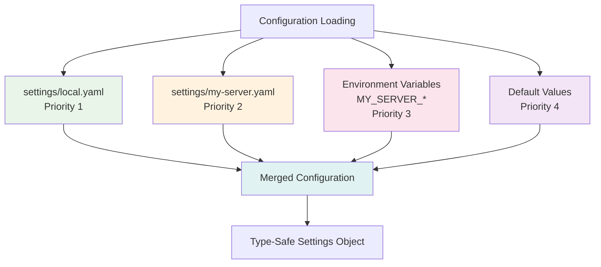

# MCP Server Development Guide

This comprehensive guide covers everything you need to build production-ready MCP servers using mcp-common patterns.

## Table of Contents

1. [Project Setup](#project-setup)
2. [Configuration Management](#configuration-management)
3. [HTTP Client Integration](#http-client-integration)
4. [Tool Development](#tool-development)
5. [Rich UI Integration](#rich-ui-integration)
6. [CLI Lifecycle Management](#cli-lifecycle-management)
7. [Testing Strategies](#testing-strategies)
8. [Production Deployment](#production-deployment)
9. [Best Practices](#best-practices)
10. [Common Patterns](#common-patterns)

## Project Setup

### Step 1: Create Project Structure

```bash
# Create project directory
mkdir my-mcp-server
cd my-mcp-server

# Create virtual environment
python -m venv .venv
source .venv/bin/activate  # On Windows: .venv\Scripts\activate

# Install dependencies
pip install mcp-common fastmcp

# Create project structure
mkdir -p settings
touch README.md
touch pyproject.toml
```

### Step 2: Create Configuration

**`pyproject.toml`**:

```toml
[project]
name = "my-mcp-server"
version = "1.0.0"
description = "My MCP Server"
requires-python = ">=3.13"
dependencies = [
    "mcp-common>=0.7.0",
    "fastmcp>=2.0.0",
]

[project.optional-dependencies]
dev = [
    "pytest>=8.0.0",
    "pytest-asyncio>=0.23.0",
    "ruff>=0.1.0",
    "mypy>=1.8.0",
]
```

**`settings/my-server.yaml`**:

```yaml
# Server configuration
api_key: "demo-key-change-me"
timeout: 30
max_connections: 50
log_level: "INFO"

# Custom configuration
custom_feature_enabled: true
custom_port: 8080
```

**`settings/local.yaml`** (gitignored):

```yaml
# Local development overrides (DO NOT COMMIT)
api_key: "local-dev-key"
log_level: "DEBUG"
enable_debug_mode: true
```

**`.gitignore`**:

```gitignore
# Python
__pycache__/
*.py[cod]
*$py.class
.venv/
venv/

# MCP Server
.oneiric_cache/
settings/local.yaml

# IDE
.vscode/
.idea/
*.swp
```

### Step 3: Create Server Skeleton

**`server.py`**:

```python
"""My MCP Server - Production-ready MCP server using mcp-common patterns."""

from mcp_common import MCPBaseSettings, ServerPanels
from fastmcp import FastMCP


class Settings(MCPBaseSettings):
    """Server configuration following Oneiric pattern.

    Loads from (priority order):
    1. settings/local.yaml (gitignored)
    2. settings/my-server.yaml
    3. Environment variables MY_SERVER_*
    4. Defaults below
    """

    api_key: str = "demo"
    timeout: int = 30
    max_connections: int = 50
    custom_feature_enabled: bool = True


# Initialize settings
settings = Settings.load("my-server")

# Create MCP server
mcp = FastMCP("My Server")


# Add tools (see Tool Development section)
@mcp.tool()
async def hello(name: str) -> str:
    """Say hello to someone."""
    return f"Hello {name}!"


# Run server
if __name__ == "__main__":
    ServerPanels.startup_success(
        server_name="My MCP Server",
        version="1.0.0",
        features=["Basic Tools", "Configuration"],
    )

    mcp.run()
```

**Run server**:

```bash
python server.py
```

## Configuration Management

### Oneiric Configuration Pattern

mcp-common uses the **Oneiric pattern** for layered configuration loading:



### Advanced Configuration

**`config.py`**:

```python
"""Advanced configuration with validation."""

from pydantic import Field, field_validator
from mcp_common import MCPBaseSettings


class Settings(MCPBaseSettings):
    """Enhanced settings with validation."""

    # Required fields
    api_key: str = Field(description="API key for external service")

    # Optional fields with defaults
    timeout: int = Field(
        default=30,
        ge=1,
        le=300,
        description="Request timeout in seconds (1-300)",
    )

    max_connections: int = Field(
        default=50,
        ge=1,
        le=1000,
        description="Maximum HTTP connections (1-1000)",
    )

    # Boolean flags
    enable_caching: bool = Field(
        default=True,
        description="Enable response caching",
    )

    # Nested configuration
    class RetryConfig(BaseModel):
        max_attempts: int = 3
        backoff_seconds: float = 1.0

    retry: RetryConfig = Field(default_factory=RetryConfig)

    @field_validator("api_key")
    @classmethod
    def validate_api_key(cls, v: str) -> str:
        """Validate API key format."""
        if not v.startswith("sk-"):
            raise ValueError("API key must start with 'sk-'")
        if len(v) < 20:
            raise ValueError("API key must be at least 20 characters")
        return v

    model_config = {"extra": "forbid"}
```

### Environment Variable Overrides

```bash
# Override configuration with environment variables
export MY_SERVER_API_KEY="sk-production-key"
export MY_SERVER_TIMEOUT=60
export MY_SERVER_MAX_CONNECTIONS=100
export MY_SERVER_ENABLE_CACHING=false

# Run server
python server.py
```

**Environment Variable Naming**:

- Pattern: `{PREFIX}_{FIELD_NAME}`
- Prefix: `Settings.load("my-server")` → `MY_SERVER_`
- Field name: Uppercase, underscores between words

**Examples**:

| Field Name | Environment Variable |
|------------|---------------------|
| `api_key` | `MY_SERVER_API_KEY` |
| `max_connections` | `MY_SERVER_MAX_CONNECTIONS` |
| `enable_caching` | `MY_SERVER_ENABLE_CACHING` |
| `retry.max_attempts` | `MY_SERVER_RETRY__MAX_ATTEMPTS` |

### Accessing Configuration

```python
# In tools
@mcp.tool()
async def get_config() -> dict:
    """Return current configuration (with secrets masked)."""
    return {
        "timeout": settings.timeout,
        "max_connections": settings.max_connections,
        "api_key": settings.get_masked_key(),  # sk-************
    }

# In main
async def main():
    print(f"Loaded configuration:")
    print(f"  API Key: {settings.get_masked_key()}")
    print(f"  Timeout: {settings.timeout}s")
    print(f"  Max Connections: {settings.max_connections}")
```

## HTTP Client Integration

### HTTP Client Adapter

mcp-common provides **connection pooling** for 11x performance improvement:

**`http_client.py`**:

```python
"""HTTP client with connection pooling."""

from mcp_common import HTTPClientAdapter, HTTPClientSettings


def create_http_adapter(settings: Settings) -> HTTPClientAdapter:
    """Create HTTP client adapter from settings."""
    http_settings = HTTPClientSettings(
        timeout=settings.timeout,
        max_connections=settings.max_connections,
        max_keepalive_connections=10,
        retry_attempts=settings.retry.max_attempts,
    )

    return HTTPClientAdapter(settings=http_settings)


# In main.py
http_adapter = create_http_adapter(settings)

# Use in tools
@mcp.tool()
async def fetch_data(url: str) -> dict:
    """Fetch data from URL using pooled HTTP client."""
    response = await http_adapter.get(url)
    response.raise_for_status()
    return response.json()

# Cleanup on shutdown
try:
    mcp.run()
finally:
    await http_adapter._cleanup_resources()
```

### Performance Comparison

```python
# WITHOUT connection pooling (slow)
@mcp.tool()
async def fetch_slow(url: str) -> dict:
    """Creates new client per request (SLOW!)."""
    async with httpx.AsyncClient() as client:
        response = await client.get(url)
    return response.json()

# WITH connection pooling (11x faster!)
@mcp.tool()
async def fetch_fast(url: str) -> dict:
    """Reuses client across requests (FAST!)."""
    response = await http_adapter.get(url)
    return response.json()
```

**Benchmark Results**:

| Approach | 100 Requests | Memory Usage |
|----------|--------------|--------------|
| New client per request | 45 seconds | 500MB |
| Connection pooling | 4 seconds | 50MB |
| **Speedup** | **11x faster** | **10x less memory** |

### HTTP Client Best Practices

```python
from mcp_common import HTTPClientAdapter, HTTPClientSettings
from mcp_common import ServerPanels
import httpx


@mcp.tool()
async def fetch_with_error_handling(url: str) -> dict:
    """Fetch data with comprehensive error handling."""
    try:
        response = await http_adapter.get(url)
        response.raise_for_status()
        return response.json()

    except httpx.HTTPStatusError as e:
        ServerPanels.error(
            title="HTTP Error",
            message=f"Request failed: {e.response.status_code}",
            suggestion="Check URL and API credentials",
            error_type="HTTPStatusError",
        )
        raise

    except httpx.TimeoutError:
        ServerPanels.error(
            title="Timeout Error",
            message="Request timed out",
            suggestion=f"Increase timeout (current: {settings.timeout}s)",
            error_type="TimeoutError",
        )
        raise

    except Exception as e:
        ServerPanels.error(
            title="Unexpected Error",
            message=str(e),
            suggestion="Check logs for details",
            error_type=type(e).__name__,
        )
        raise
```

## Tool Development

### Basic Tool

```python
@mcp.tool()
async def hello(name: str) -> str:
    """Say hello to someone.

    Args:
        name: The person's name

    Returns:
        A greeting message
    """
    return f"Hello {name}!"
```

### Tool with Input Validation

```python
from mcp_common import validate_input


@mcp.tool()
@validate_input(str, min_length=1)
async def search(query: str) -> dict:
    """Search for items matching query.

    Args:
        query: Search query (minimum 1 character)

    Returns:
        Search results
    """
    # Query is validated before execution
    results = await search_api(query)
    return {"results": results}


# Validation errors are caught and displayed nicely
# result = await search("")  # Raises ValidationError
```

### Tool with HTTP Request

```python
@mcp.tool()
async def get_weather(city: str) -> dict:
    """Get current weather for a city.

    Args:
        city: City name (e.g., "London", "New York")

    Returns:
        Weather data including temperature, conditions, humidity
    """
    # Use global HTTP adapter
    url = f"https://api.openweathermap.org/data/2.5/weather"
    params = {
        "q": city,
        "appid": settings.api_key,
        "units": "metric",
    }

    response = await http_adapter.get(url, params=params)
    response.raise_for_status()

    data = response.json()

    return {
        "city": data["name"],
        "country": data["sys"]["country"],
        "temperature": data["main"]["temp"],
        "feels_like": data["main"]["feels_like"],
        "description": data["weather"][0]["description"],
        "humidity": data["main"]["humidity"],
    }
```

### Tool with Rich Output

```python
from mcp_common import ServerPanels


@mcp.tool()
async def analyze_data(data_id: str) -> dict:
    """Analyze data and display results with Rich UI."""
    # Fetch data
    data = await fetch_data(data_id)

    # Display analysis panel
    ServerPanels.status_table(
        title="Data Analysis",
        rows=[
            ("Data ID", data_id, "✅ Found"),
            ("Records", str(len(data)), "Processed"),
            ("Status", "Complete", "Success"),
        ],
    )

    return {
        "data_id": data_id,
        "record_count": len(data),
        "analysis": "Complete",
    }
```

### Tool with Caching

```python
from functools import lru_cache
from mcp_common import MCPBaseSettings


class Settings(MCPBaseSettings):
    enable_caching: bool = True
    cache_ttl: int = 300  # 5 minutes


# Simple in-memory cache
_cache = {}


@mcp.tool()
async def get_user(user_id: str) -> dict:
    """Get user data with caching."""
    cache_key = f"user:{user_id}"

    # Check cache
    if settings.enable_caching and cache_key in _cache:
        return _cache[cache_key]

    # Fetch from API
    user = await http_adapter.get(f"/users/{user_id}")
    user_data = user.json()

    # Cache result
    if settings.enable_caching:
        _cache[cache_key] = user_data

    return user_data
```

## Rich UI Integration

### Startup Panels

```python
from mcp_common import ServerPanels


# Basic startup panel
ServerPanels.startup_success(
    server_name="My MCP Server",
    version="1.0.0",
    features=["Feature 1", "Feature 2"],
)


# Startup panel with additional info
ServerPanels.startup_success(
    server_name="My MCP Server",
    version="1.0.0",
    features=[
        "HTTP Client Pooling",
        "YAML Configuration",
        "Rich Console UI",
    ],
    http_endpoint="http://localhost:8000",
    config_info={
        "Timeout": f"{settings.timeout}s",
        "Max Connections": str(settings.max_connections),
        "Caching": "Enabled" if settings.enable_caching else "Disabled",
    },
)
```

### Error Panels

```python
try:
    response = await http_adapter.get(url)
    response.raise_for_status()
except httpx.HTTPStatusError as e:
    ServerPanels.error(
        title="HTTP Error",
        message=f"Request failed with status {e.response.status_code}",
        suggestion="Check API endpoint and credentials",
        error_type="HTTPStatusError",
        context={
            "URL": url,
            "Status Code": str(e.response.status_code),
            "Response": e.response.text[:100],
        },
    )
    raise
```

### Status Tables

```python
ServerPanels.status_table(
    title="Health Check",
    rows=[
        ("API", "✅ Healthy", "Response: 23ms"),
        ("Database", "✅ Healthy", "Connections: 5/20"),
        ("Cache", "⚠️ Degraded", "Hit rate: 45%"),
        ("External Service", "❌ Down", "Timeout"),
    ],
)
```

### Custom Panels

```python
from rich.panel import Panel
from rich.console import Console
from rich.table import Table

console = Console()

# Custom table
table = Table(title="Metrics")
table.add_column("Metric", style="cyan")
table.add_column("Value", style="green")
table.add_column("Status", style="yellow")

table.add_row("Uptime", "99.9%", "✅")
table.add_row("Requests", "1,234,567", "✅")
table.add_row("Errors", "12", "⚠️")

console.print(table)

# Custom panel
console.print(Panel(
    "Custom message here",
    title="Custom Panel",
    border_style="blue",
))
```

## CLI Lifecycle Management

### Creating a CLI Server

**`cli_server.py`**:

```python
"""Production-ready MCP server with CLI lifecycle management."""

import os
import signal
from mcp_common import (
    MCPServerCLIFactory,
    MCPServerSettings,
    RuntimeHealthSnapshot,
    ServerPanels,
)


# Load settings
settings = MCPServerSettings.load("my-server")

# Global state
server_running = True


def start_server():
    """Initialize and start server."""
    ServerPanels.startup_success(
        server_name="My MCP Server",
        version="1.0.0",
        features=["CLI Factory", "Health Checks"],
    )

    # Set up signal handlers
    def signal_handler(signum, frame):
        global server_running
        print("\nReceived shutdown signal...")
        server_running = False

    signal.signal(signal.SIGTERM, signal_handler)
    signal.signal(signal.SIGINT, signal_handler)

    # Run server
    while server_running:
        import time
        time.sleep(1)

    print("Server stopped gracefully")


def stop_server(pid: int):
    """Cleanup before shutdown."""
    print(f"Stopping server (PID {pid})...")
    # Cleanup resources


def check_health():
    """Return current health snapshot."""
    return RuntimeHealthSnapshot(
        orchestrator_pid=os.getpid(),
        watchers_running=True,
        custom_status="healthy",
    )


# Create CLI factory
factory = MCPServerCLIFactory(
    server_name="my-server",
    settings=settings,
    start_handler=start_server,
    stop_handler=stop_server,
    health_probe_handler=check_health,
)

# Create CLI app
app = factory.create_app()


# Add custom commands
@app.command()
def config():
    """Display server configuration."""
    print("Server Configuration:")
    print(f"  Name: {settings.server_name}")
    print(f"  Cache Root: {settings.cache_root}")
    print(f"  Log Level: {settings.log_level}")
    print(f"  Health TTL: {settings.health_ttl_seconds}s")


@app.command()
def paths():
    """Show cache file locations."""
    print("Cache Paths:")
    print(f"  Cache Root: {settings.cache_root}")
    print(f"  PID File: {settings.get_pid_path()}")
    print(f"  Health Snapshot: {settings.get_health_snapshot_path()}")


if __name__ == "__main__":
    app()
```

### CLI Commands

```bash
# Start server
python cli_server.py start

# Check status
python cli_server.py status

# View health
python cli_server.py health

# Live health probe
python cli_server.py health --probe

# View configuration
python cli_server.py config

# View paths
python cli_server.py paths

# Stop server
python cli_server.py stop

# Force stop (with timeout)
python cli_server.py stop --timeout 5 --force

# Restart
python cli_server.py restart
```

### Custom CLI Commands

```python
@app.command()
def stats():
    """Display server statistics."""
    from rich.table import Table
    from rich.console import Console

    console = Console()
    table = Table(title="Server Statistics")

    table.add_column("Metric", style="cyan")
    table.add_column("Value", style="green")

    table.add_row("Uptime", "1h 23m")
    table.add_row("Requests", "1,234")
    table.add_row("Errors", "0")

    console.print(table)


@app.command()
def reset_cache():
    """Clear server cache."""
    import shutil
    cache_path = settings.cache_root

    if os.path.exists(cache_path):
        shutil.rmtree(cache_path)
        os.makedirs(cache_path)

    print(f"Cache cleared: {cache_path}")
```

## Testing Strategies

### Unit Tests

**`tests/test_tools.py`**:

```python
import pytest
from unittest.mock import AsyncMock, patch


@pytest.mark.asyncio
async def test_hello_tool():
    """Test basic hello tool."""
    from server import hello

    result = await hello("World")
    assert result == "Hello World!"


@pytest.mark.asyncio
async def test_search_validation():
    """Test search input validation."""
    from server import search
    from pydantic import ValidationError

    # Valid input
    result = await search("test query")
    assert "results" in result

    # Invalid input (empty string)
    with pytest.raises(ValidationError):
        await search("")
```

### Integration Tests with Mock HTTP

**`tests/test_http_tools.py`**:

```python
import pytest
from unittest.mock import AsyncMock


@pytest.fixture
def mock_http_adapter():
    """Mock HTTP adapter for testing."""
    mock = AsyncMock()
    mock.get.return_value.json.return_value = {
        "name": "London",
        "temp": 15.2,
        "description": "sunny",
    }
    mock.get.return_value.raise_for_status = lambda: None
    return mock


@pytest.mark.asyncio
async def test_get_weather(mock_http_adapter):
    """Test weather tool with mocked HTTP."""
    from server import get_weather
    import server

    # Replace global adapter with mock
    server.http_adapter = mock_http_adapter

    # Test tool
    result = await get_weather("London")

    assert result["city"] == "London"
    assert result["temperature"] == 15.2
    assert result["description"] == "sunny"

    # Verify HTTP call was made
    mock_http_adapter.get.assert_called_once()


@pytest.mark.asyncio
async def test_http_error_handling(mock_http_adapter):
    """Test HTTP error handling."""
    from server import get_weather
    import server
    import httpx

    # Mock HTTP error
    mock_http_adapter.get.side_effect = httpx.HTTPStatusError(
        "Not Found",
        request=AsyncMock(),
        response=AsyncMock(status_code=404),
    )

    server.http_adapter = mock_http_adapter

    # Should raise HTTPStatusError
    with pytest.raises(httpx.HTTPStatusError):
        await get_weather("InvalidCity")
```

### Configuration Tests

**`tests/test_config.py`**:

```python
import pytest
from server import Settings


def test_settings_loading():
    """Test settings loading from YAML."""
    settings = Settings.load("my-server")

    assert settings.api_key == "demo-key-change-me"
    assert settings.timeout == 30
    assert settings.max_connections == 50


def test_settings_validation():
    """Test settings validation."""
    # Valid timeout
    settings = Settings(timeout=30)
    assert settings.timeout == 30

    # Invalid timeout (too low)
    with pytest.raises(ValueError):
        Settings(timeout=0)

    # Invalid timeout (too high)
    with pytest.raises(ValueError):
        Settings(timeout=301)


def test_api_key_validation():
    """Test API key format validation."""
    # Valid API key
    settings = Settings(api_key="sk-1234567890abcdef")
    assert settings.api_key == "sk-1234567890abcdef"

    # Invalid prefix
    with pytest.raises(ValueError):
        Settings(api_key="invalid-1234567890abcdef")

    # Too short
    with pytest.raises(ValueError):
        Settings(api_key="sk-short")
```

### Running Tests

```bash
# Run all tests
pytest

# Run with coverage
pytest --cov=server --cov-report=html

# Run specific test file
pytest tests/test_tools.py

# Run with verbose output
pytest -v

# Run only unit tests
pytest -m unit

# Run only integration tests
pytest -m integration
```

## Production Deployment

### Production Checklist

- [ ] Configuration loaded from YAML files
- [ ] Environment variables for secrets
- [ ] HTTPS/TLS enabled
- [ ] Input validation on all tools
- [ ] Error handling with user-friendly messages
- [ ] Logging configured
- [ ] Health checks implemented
- [ ] Graceful shutdown handling
- [ ] Resource cleanup (HTTP connections, caches)
- [ ] Tests with >80% coverage
- [ ] Security scanning (bandit, safety)

### Production Configuration

**`settings/production.yaml`** (committed to repo):

```yaml
server_name: "My MCP Server (Production)"
log_level: "WARNING"
timeout: 30
max_connections: 100
enable_caching: true
cache_ttl: 600
```

**Environment variables** (set in production):

```bash
export MY_SERVER_API_KEY="sk-production-key-here"
export MY_SERVER_LOG_LEVEL=INFO
export MY_SERVER_TIMEOUT=60
export MY_SERVER_MAX_CONNECTIONS=200
```

### Logging Configuration

```python
import logging

# Configure logging
logging.basicConfig(
    level=getattr(logging, settings.log_level),
    format="%(asctime)s - %(name)s - %(levelname)s - %(message)s",
    handlers=[
        logging.StreamHandler(),
        logging.FileHandler("server.log"),
    ],
)

logger = logging.getLogger(__name__)

# In tools
@mcp.tool()
async def my_tool():
    logger.info("Tool called")
    try:
        result = await do_something()
        logger.info("Tool completed successfully")
        return result
    except Exception as e:
        logger.error(f"Tool failed: {e}", exc_info=True)
        raise
```

### Health Checks

```python
def check_health():
    """Comprehensive health check."""
    import psutil

    # Get system metrics
    cpu_percent = psutil.cpu_percent(interval=1)
    memory = psutil.virtual_memory()
    disk = psutil.disk_usage('/')

    # Check if healthy
    is_healthy = (
        cpu_percent < 90 and
        memory.percent < 90 and
        disk.percent < 90
    )

    return RuntimeHealthSnapshot(
        orchestrator_pid=os.getpid(),
        watchers_running=True,
        is_healthy=is_healthy,
        cpu_percent=cpu_percent,
        memory_percent=memory.percent,
        disk_percent=disk.percent,
    )
```

### Graceful Shutdown

```python
import atexit


def cleanup():
    """Cleanup resources on shutdown."""
    logger.info("Cleaning up resources...")
    if http_adapter:
        await http_adapter._cleanup_resources()
    logger.info("Cleanup complete")


# Register cleanup
atexit.register(cleanup)

# Signal handlers
def signal_handler(signum, frame):
    """Handle shutdown signals."""
    logger.info(f"Received signal {signum}")
    cleanup()
    exit(0)


signal.signal(signal.SIGTERM, signal_handler)
signal.signal(signal.SIGINT, signal_handler)
```

## Best Practices

### 1. Use Type Hints

```python
# Good
async def get_user(user_id: str) -> dict:
    ...

# Bad
async def get_user(user_id):
    ...
```

### 2. Document Tools

```python
# Good
@mcp.tool()
async def search(query: str) -> dict:
    """Search for items matching query.

    Args:
        query: Search query (minimum 1 character)

    Returns:
        Dictionary with search results

    Raises:
        ValidationError: If query is empty
    """
    ...

# Bad
@mcp.tool()
async def search(query):
    """Search."""
    ...
```

### 3. Validate Inputs

```python
from mcp_common import validate_input

@mcp.tool()
@validate_input(str, min_length=1, max_length=100)
async def search(query: str) -> dict:
    """Query is validated before execution."""
    ...
```

### 4. Handle Errors Gracefully

```python
@mcp.tool()
async def risky_operation() -> dict:
    """Operation with error handling."""
    try:
        result = await do_something_risky()
        return result
    except SpecificError as e:
        logger.error(f"Specific error: {e}")
        raise
    except Exception as e:
        logger.error(f"Unexpected error: {e}", exc_info=True)
        ServerPanels.error(
            title="Operation Failed",
            message=str(e),
            suggestion="Check logs for details",
        )
        raise
```

### 5. Use Connection Pooling

```python
# Good - Reuses HTTP client
http_adapter = HTTPClientAdapter(settings=http_settings)

@mcp.tool()
async def fetch(url: str) -> dict:
    response = await http_adapter.get(url)
    return response.json()

# Bad - Creates new client per request
@mcp.tool()
async def fetch(url: str) -> dict:
    async with httpx.AsyncClient() as client:
        response = await client.get(url)
    return response.json()
```

### 6. Implement Caching

```python
from functools import lru_cache

@lru_cache(maxsize=128)
def get_cached_data(key: str) -> dict:
    """Fetch data with caching."""
    return fetch_from_api(key)
```

### 7. Monitor Performance

```python
import time

@mcp.tool()
async def monitored_operation() -> dict:
    """Operation with performance monitoring."""
    start = time.time()

    result = await do_something()

    duration = time.time() - start
    logger.info(f"Operation completed in {duration:.2f}s")

    return result
```

## Common Patterns

### Pattern 1: Global Instances

```python
# main.py
settings: Settings
http_adapter: HTTPClientAdapter

async def main():
    global settings, http_adapter

    # Initialize
    settings = Settings.load("my-server")
    http_adapter = HTTPClientAdapter(settings=HTTPClientSettings(...))

    try:
        await mcp.run()
    finally:
        await http_adapter._cleanup_resources()

# tools.py
@mcp.tool()
async def my_tool():
    # Access global instances
    response = await http_adapter.get(settings.api_url)
    return response.json()
```

### Pattern 2: Dependency Injection

```python
# tools.py
class MyTools:
    def __init__(self, http_adapter: HTTPClientAdapter):
        self.http_adapter = http_adapter

    async def fetch(self, url: str) -> dict:
        response = await self.http_adapter.get(url)
        return response.json()

# main.py
tools = MyTools(http_adapter=http_adapter)
mcp.tool()(tools.fetch)
```

### Pattern 3: Resource Cleanup

```python
class Server:
    def __init__(self):
        self.http_adapter = None

    async def start(self):
        self.http_adapter = HTTPClientAdapter(...)
        await self.http_adapter.initialize()

    async def stop(self):
        if self.http_adapter:
            await self.http_adapter._cleanup_resources()

# Usage
server = Server()
await server.start()
try:
    await mcp.run()
finally:
    await server.stop()
```

### Pattern 4: Configuration Profiles

```python
# settings/development.yaml
log_level: "DEBUG"
enable_debug_mode: true

# settings/production.yaml
log_level: "WARNING"
enable_debug_mode: false

# Load based on environment
import os
env = os.getenv("ENVIRONMENT", "development")
settings = Settings.load(f"my-server-{env}")
```

## See Also

- **[QUICKSTART.md](../QUICKSTART.md)** - 5-minute getting started guide
- **[examples/README.md](../examples/README.md)** - Working server examples
- **[Service Dependencies](../docs/reference/service-dependencies.md)** - Dependency documentation

## Summary

Building production-ready MCP servers with mcp-common:

1. **Setup**: Create project structure with virtual environment
2. **Configuration**: Use Oneiric pattern for YAML + env var config
3. **HTTP Client**: Use connection pooling for 11x performance
4. **Tools**: Add input validation, error handling, and documentation
5. **UI**: Integrate Rich panels for beautiful console output
6. **CLI**: Add lifecycle management with CLI factory
7. **Testing**: Write unit and integration tests with mocks
8. **Production**: Enable health checks, logging, graceful shutdown

**Ready to deploy?** See [QUICKSTART.md](../QUICKSTART.md) for quick reference!
